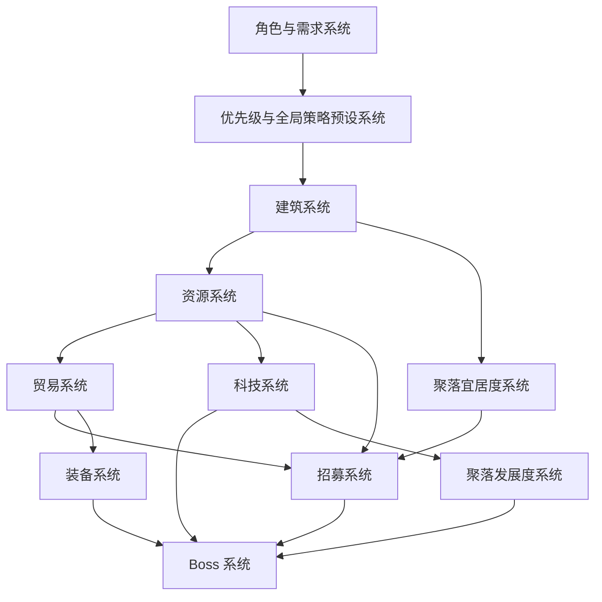

# 系统总表

## 1. 目的

本文档用于定义 V1 的系统范围、优先级、依赖关系和推进顺序，作为研发排期与实现对齐的入口。

## 2. 系统清单

### MVP / 垂直切片

1. 游戏循环与阶段系统
2. 角色与需求系统
3. 优先级与全局策略预设系统
4. 资源系统
5. 建筑系统
6. 招募系统
7. 科技系统
8. Boss 系统
9. 存档系统
10. 聚落宜居度系统
11. 聚落发展度系统
12. 贸易系统

### 辅助系统

13. 装备系统
14. 战斗属性系统
15. 引导系统
16. UI 状态同步系统
17. 事件与提示系统

### 后续扩展

18. 地形与空间系统
19. 装饰系统
20. 更丰富的角色社交与个性系统
21. 地板、墙体、道路、围栏等空间建设系统

## 3. 依赖关系

## 4. 推荐实现顺序

1. 游戏循环与阶段系统
2. 资源系统
3. 角色与需求系统
4. 优先级与全局策略预设系统
5. 建筑系统
6. 招募系统
7. 聚落宜居度系统
8. 聚落发展度系统
9. 科技系统
10. Boss 系统
11. 贸易系统
12. 存档系统
13. 装备系统
14. 引导与 UI 对齐

## 5. 版本边界

- V1 只做可玩通的闭环，不追求系统数量最大化。
- 所有新增系统都必须先进入本总表，再补对应设计文档。
- 若系统无法归入本总表，默认不进入当前 Sprint。
- 贸易系统进入 V1，是为了解决资源输出口不足，不是为了扩张经济复杂度。
- 地板、墙体、道路、围栏不进入当前 V1。

## 6. 高风险系统

- 角色需求与优先级耦合
- 全局预设覆盖手动优先级
- 招募站刷新与商队周期
- 聚落宜居度与发展度公开反馈
- Boss 刷新与难度分层
- 存档版本兼容
- 贸易系统对资源保留线与建造队列的保护

## 7. 验收标准

- 任一系统都能在本文档中找到依赖关系。
- Sprint 排期可以从本文档直接拆出任务。
- 新增系统不会破坏主循环定义。
- 贸易系统不会取代建造、科技、Boss 在 V1 中的主循环地位。

